# Use Case
This bot reduces the menial work that has to be done before and during the contests. And makes you more productive while doing contests.

# How to install the bot:
- First clone the repository into a directory of your choice.
- To run this bot **python3** is necessary. If you don't have python3 [click this link to download](https://www.python.org/downloads/) 
- Navigate to the directory in which you cloned the repository and open the terminal in the same path.
- run the command 
    For windows users:
    ```shell
    pip install -r requirements.txt
    ```
    For mac or linux users:
    ```shell
    pip3 install -r requirements.txt
    ```
# How to use it:
- To participate in a contest:
- Just run the setup.py file. It is a interactive program all the details needed will be prompted by the program.
- The program will create a directory in the specifed directory and will create subDirectories for all the problems in a contest. The tree structure will be like.
  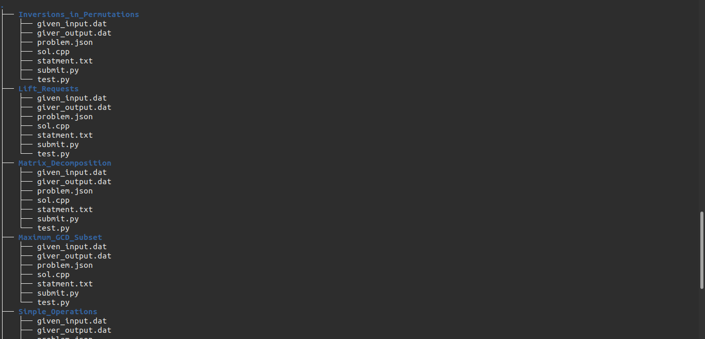
- The files in those directories are:
  - **statment.txt:** contains the problem statment.
  - **given_input.dat:** Contains the sample input of the problem.
  - **given_output.dat**: Contains the sample output of the problem.
  - **sol.cpp:** Contains a basic template in which you have to write the solution of the problem.
  - **test.py:** When you run this program your code will be tested against the sample input testcases.You can check your output in yourOut.dat file.*(If you are a windows user check out the **note** below).*
  - **submit.py:** When you run this program the code you wrote will be submitted to the online judge and the results will be printed on your terminal.
- Now using this bot you can solve problems without having the hassle of doing all the jobs manually from the browser.

## Commands for running:
In Windows:
```shell
python (filename)
```
In linux or macOS:
```shell
python3 (filename)
```
### Note:
- when you are running the test.py file it may not work in a windows system to make it work you have to install the g++ compiler [checkout this link to see how to download and install g++ compiler](https://youtu.be/sXW2VLrQ3Bs).
- The *template.cpp* file in your cloned repository. Is from where the *sol.cpp* files are copied if you want to use your own template instead of the default you can replace the *template.cpp* file with your own template code.


## Screenshots:
### Creating contest pics:
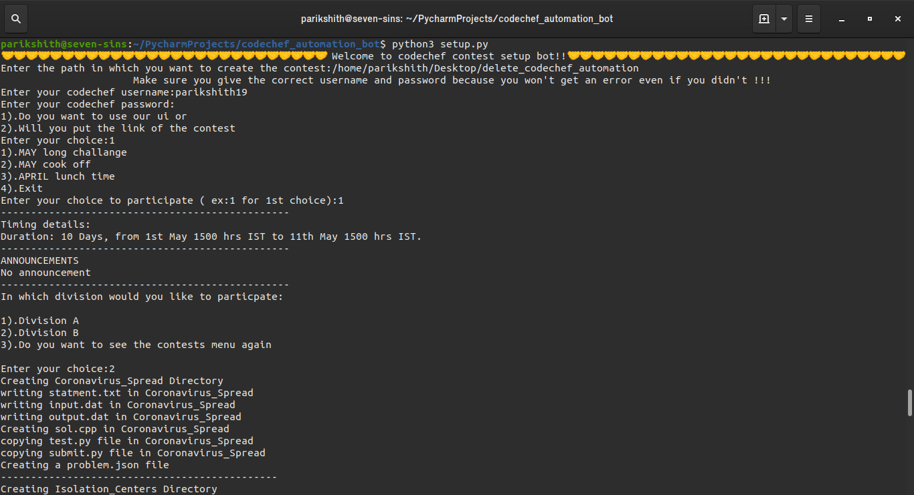
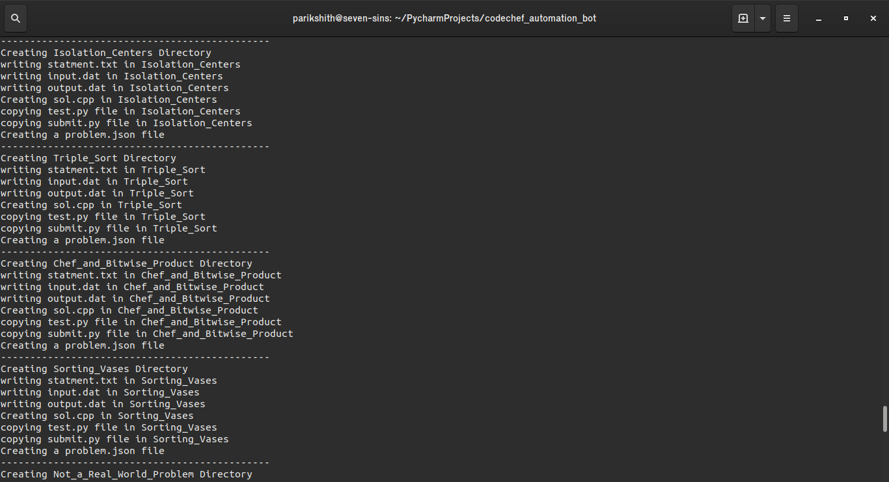
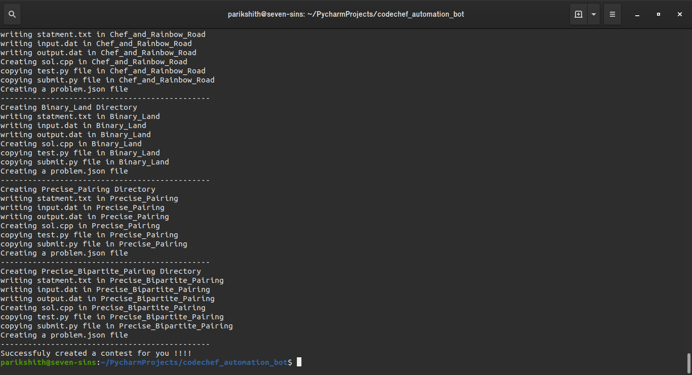

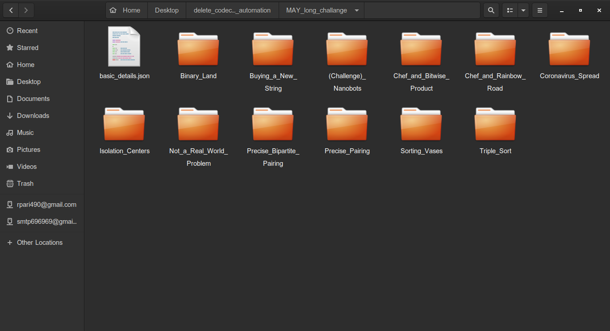
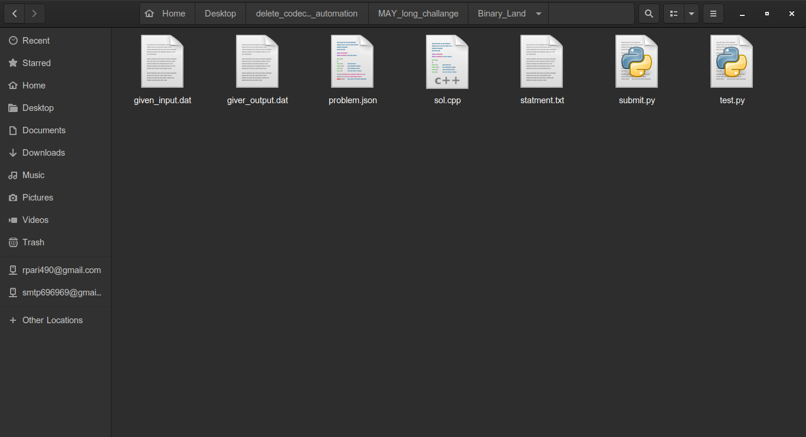
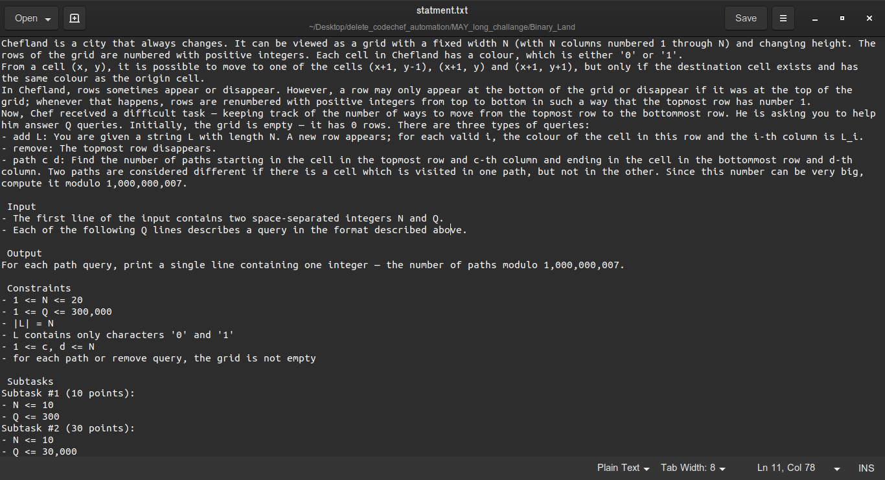
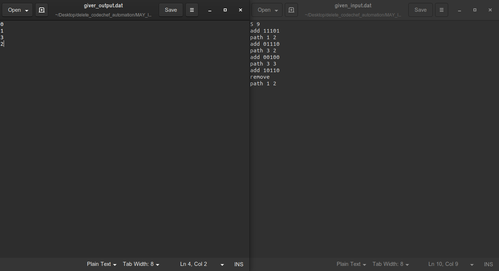
### Testing solution pics:
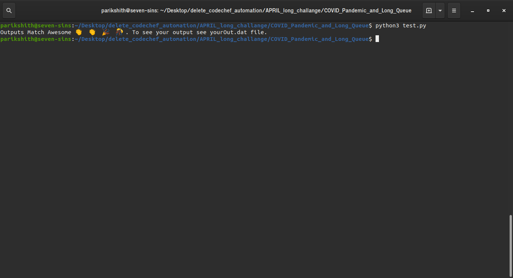
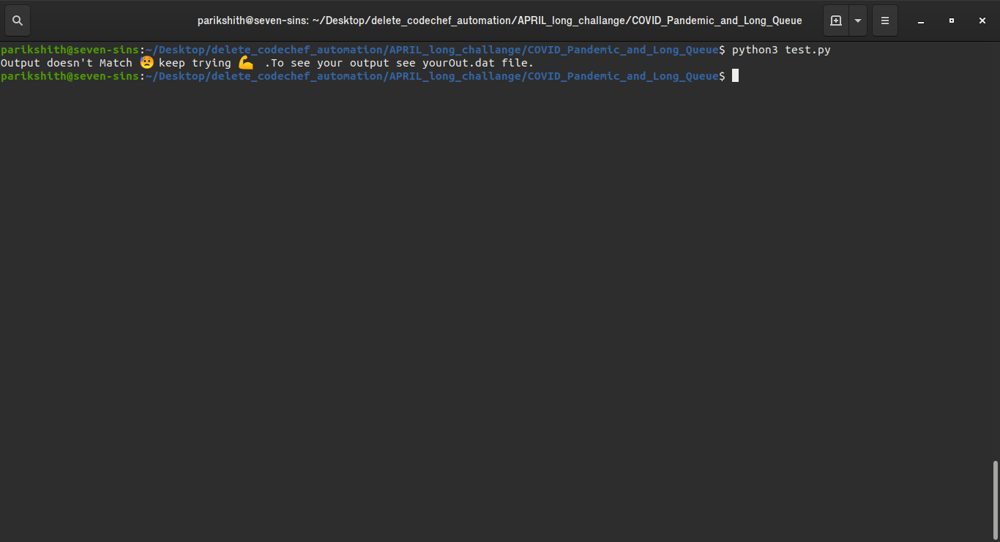
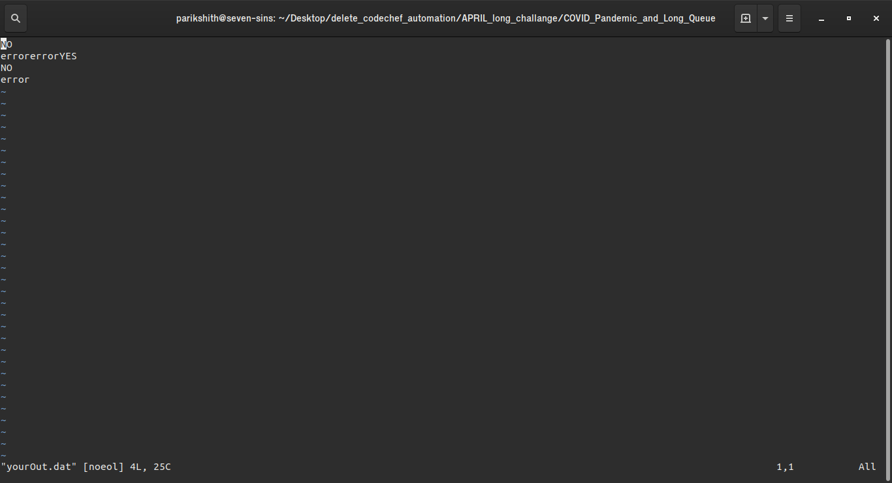
### Submitting solution pics:
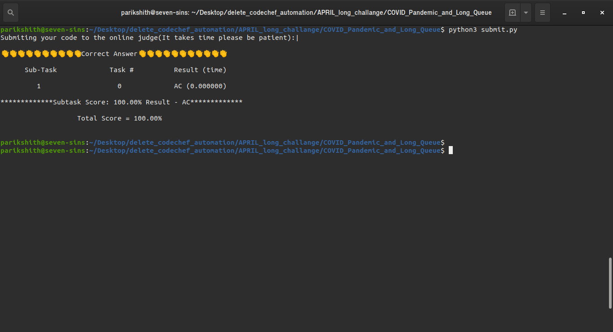
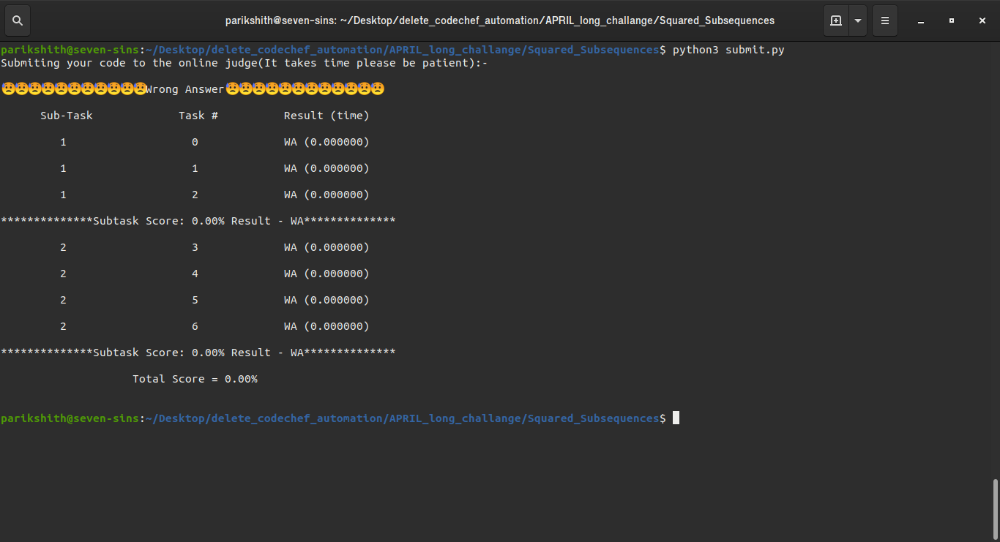

### Contact information:
Please conact me if you have any query regarding the usage or if you want to contribute to the code.                                
**Email**: parikshithraju8@gmail.com